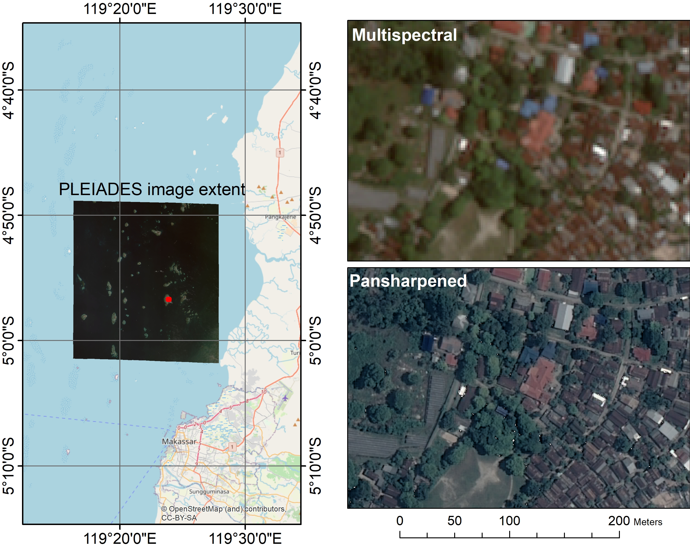

# Map of islands and shallow water areas in the Spermonde Archipelago (Indonesia) 
This repository contains data and code used to make a map of islands and shallow water areas for the Spermonde Archipelago, Indonesia. The map was obtained using a two-stepped classification approach, described below, and simple statistics and graphs were then calculated in python.

## Similar works in the same area
This is not the first work where satellite data is used to map the study area. For previous works, see:

> Nurdin, N., Komatsu, T., AS, M.A., Djalil, A.R. and Amri, K., 2015. Multisensor and multitemporal data from Landsat images to detect damage to coral reefs, small islands in the Spermonde archipelago, Indonesia. Ocean Science Journal, 50(2), pp.317-325.

> Fujii, M., 2017. Mapping the change of coral reefs using remote sensing and in situ measurements: a case study in Pangkajene and Kepulauan Regency, Spermonde Archipelago, Indonesia. Journal of oceanography, 73(5), pp.623-645.

> Thalib, M.S., Nurdin, N. and Aris, A., 2018, June. The ability of lyzenga’s algorithm for seagrass mapping using sentinel-2a imagery on Small Island, Spermonde Archipelago, Indonesia. In Proceeding of IOP Conference Series: Earth and Environmental Science (Vol. 165, No. 1, p. 012028).

## Two-stepped mapping approach
### Step 1: High-resolution imagery mapping
The starting point is a high-resolution multispectral (R,G,B,NIR) PLEIADES image acquired on 2020-03-26. The image was pan-sharpened using ArcMap and the panchromatic image accompanying the original dataset. The image is shown below within the broader context of the Spermonde Archipelago.

This image was then classified with Trimble Ecognition Developer (ver.9.5.1) as follows:
1. The image was segmented using a "multiresolution segmentation", giving as weights for R,G,B = 1 and NIR = 2. The scale parameter of the segmentation was set to 200. The shape of the homogeneity criterion was set to 0.1 and its compactness was set to 0.5.
2. Six classes were defined with the help of the pansharpened image: Built environment,Deep water,Shallow-water sand/reef complex,Beach sands,Shallow-water reef,Vegetation. These classes were used in a Nearest Neighbor classification. The results were exported as shapefile (smooting the edges with the built-in Ecognition export function).

Some examples of the results of the Nearest Neighbor classification are shown hereafter. The shapefile is available in the "data" folder.

IMAGE TRIMBLE RESULTS

### Step 2: SENTINEL2 classification
The shapefile gathered from Step1 was edited in ArcMap. First, deep water areas were deleted and a simpler feature was drawn, to avoid having too many polygons for the next classification. Second, very small polygons were deleted. A column was added in the shapefile attribute table, with integer values corresponding to classes. Those are the results of classification errors due to the presence of clouds or small boats on the water surface.

This "cleaned" shapefile was then imported as "Asset" in Google Earth Engine. A polygon was drawn to limit the analysis area. Then, the code "Sentinel_Class" was run on the Earth Engine Code Editor. The code uses the shapefile classes as training dataset in a minimum distance classification of SENTINEL2 imagery (2020-01-1 to 2020-10-11). Before proceeding with the classification, the co-registration of the SENTINEL2 and PLEIADES imagery was verified.

The results of the classification were exported in google Drive as GeoTiff, and the image histograms were exported from the Earth Engine Code Editor Console as CSV.

